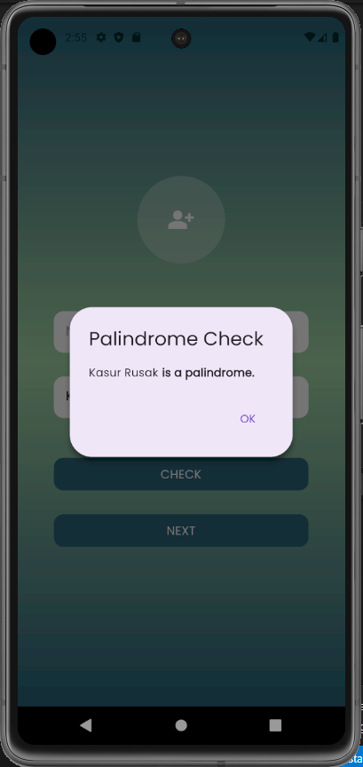

# Mobile Developer Intern

Flutter Project Palindrome Check and Consume Api

Created by Abian Ayatullah Fikri

## Getting Started

Project ini merupakan project intern test untuk mobile developer, yang mana menerapkan 
Consume Api untuk mengambil data get yang ada di api kemudian di tampilkan dalam bentuk list berupa
firstname,lastname, email, dan avatar. 

Project ini memiliki 3 tampilan:

## First Screen

- 2 TextFieldForm(name,palindrome)
- 2 Button(Check Palindrome, move to Second Screen and get data name from first screen)

## Second Screen

- Get Username from FirstScreen
- If Selected User Name not null maka show and Change Welcome Username menjadi nama yang di ambil dari third Screen
- Button Choose a User to move third screen

## Third Screen

- Consume Api Get and show using list

